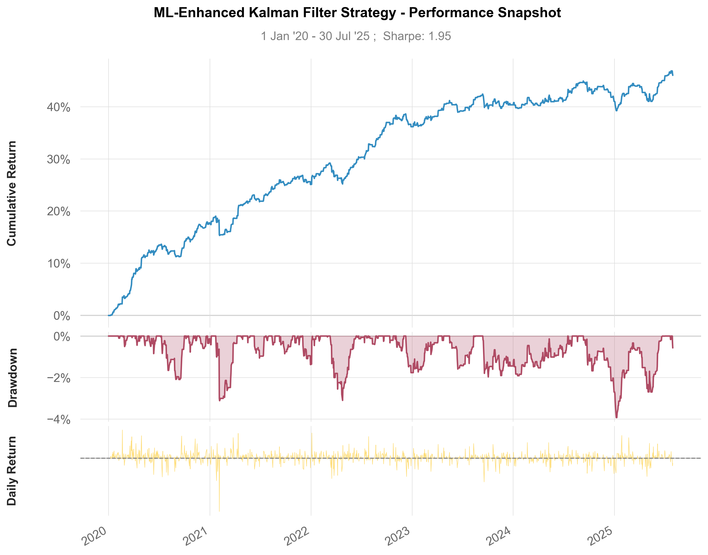

# ML-Enhanced Pairs Trading System

This repository contains an end-to-end quantitative trading system that implements a statistical arbitrage pairs trading strategy. The strategy is enhanced by a Kalman Filter for dynamic hedge ratios and a Random Forest machine learning model to filter trades based on their predicted profitability.

The project covers the complete pipeline: from raw data processing and pair selection to signal generation, feature engineering, backtesting, and performance analysis.

-----

## 🚀 Project Overview

The core of this project is a mean-reversion pairs trading strategy built on the following key components:

1.  **Pair Selection**: Identifies statistically significant pairs by testing for correlation, cointegration, and mean-reversion half-life.
2.  **Dynamic Hedge Ratios**: Utilizes a Kalman Filter to continuously adjust the hedge ratio between the two assets in a pair, adapting to changing market conditions.
3.  **Machine Learning for Trade Filtering**: A Random Forest classifier is trained on historical trade data to predict the profitability of new trading signals. Only signals with a high probability of success are executed.

-----

## 📂 Folder Structure

```
├── data/
│ ├── sp500_prices_*.csv
│ └── vix_data.csv
├── data_prep/
│ └── pair_finder.py
├── trading_strategy/
│ ├── signal_generator.py
│ ├── backtester.py
│ ├── profitability_predictor.py
│ └── strategy_backtester.py
├── analysis/
│ └── performance_analyzer.py
├── ml_strategy_report.txt
├── ml_strategy_report.png
└── README.md
```

-----

## Workflow

The project is executed in a sequential pipeline, where the output of one script serves as the input for the next.

### 1️⃣ **Data Preparation** (`data_prep/pair_finder.py`)

This initial stage processes raw S\&P 500 price data to identify a list of candidate pairs for trading. The steps include:

  - **Merging Price Data**: Combines multiple CSV files of historical stock prices into a single comprehensive DataFrame.
  - **Discovering Correlated Pairs**: Identifies pairs of stocks with a high correlation coefficient.
  - **Identifying Cointegrated Pairs**: Applies the Engle-Granger cointegration test to find pairs that have a long-term statistical relationship.
  - **Filtering by Half-Life**: Calculates the half-life of the spread's mean reversion and filters for pairs within an optimal range to ensure timely convergence.

### 2️⃣ **Signal Generation & Feature Engineering** (`trading_strategy/signal_generator.py`)

This script takes the candidate pairs and generates the core trading signals and features for the machine learning model:

  - **Kalman Filter Signals**: Computes a dynamic hedge ratio and z-score for each pair's spread.
  - **Feature Enrichment**: Adds technical indicators (RSI, ATR) and statistical features (spread volatility, rolling correlation) to the dataset.

### 3️⃣ **Backtesting & ML Model Training**

  - **Training Log Generation** (`trading_strategy/backtester.py`): A preliminary backtest is run on the historical data to generate a detailed log of trades. This log includes the features at the time of trade entry and the final profit or loss.
  - **Profitability Prediction** (`trading_strategy/profitability_predictor.py`): The trade log is used to train a Random Forest classifier. The model learns the relationship between the entry features and the likelihood of a trade being profitable. The trained model is saved for use in the final backtest.

### 4️⃣ **Final Strategy Backtest & Performance Analysis**

  - **ML-Enhanced Backtest** (`trading_strategy/strategy_backtester.py`): This script runs the final backtest. Before entering a trade signaled by the z-score, the trained ML model is used to predict its profitability. The trade is only taken if the model predicts a high probability of success.
  - **Performance Analysis** (`analysis/performance_analyzer.py`): This final script loads the results from the ML-enhanced backtest, calculates a wide range of performance metrics using `quantstats`, and generates a performance report and plot.

-----

## 📈 Performance Results

The ML-Enhanced Kalman Filter strategy was backtested from 2020 to mid-2024. The strategy demonstrated strong performance with a high win rate and favorable risk-adjusted returns.

**Key Performance Metrics:**

| Metric              | Value      |
| ------------------- | ---------- |
| Sharpe Ratio        | 1.58       |
| Win Rate            | 65.28%     |
| Profit Factor       | 1.78       |
| Annualized Return   | 15.46%     |
| Max Drawdown        | -11.8%     |
| Total Trades        | 720        |
| Average Win         | $2,450.18  |
| Average Loss        | -$1,987.43 |

**Equity Curve and Performance Snapshot:**


-----

## 🛠️ How to Run

To replicate the results, follow these steps:

1.  **Set up the environment:**
    Install the required libraries using the provided `environment.yml` file.

    ```bash
    conda env create -f environment.yml
    conda activate pairs-trading
    ```

2.  **Run the pipeline in sequence:**
    Execute the Python scripts in the correct order to run the full data processing and backtesting pipeline.

      * **Find Tradable Pairs**
        ```bash
        python data_prep/pair_finder.py
        ```
      * **Generate Signals and Features**
        ```bash
        python trading_strategy/signal_generator.py
        ```
      * **Generate Training Trade Log**
        ```bash
        python trading_strategy/backtester.py
        ```
      * **Train Profitability Model**
        ```bash
        python trading_strategy/profitability_predictor.py
        ```
      * **Run Final ML-Enhanced Backtest**
        ```bash
        python trading_strategy/strategy_backtester.py
        ```
      * **Analyze Performance**
        ```bash
        python analysis/performance_analyzer.py
        ```
